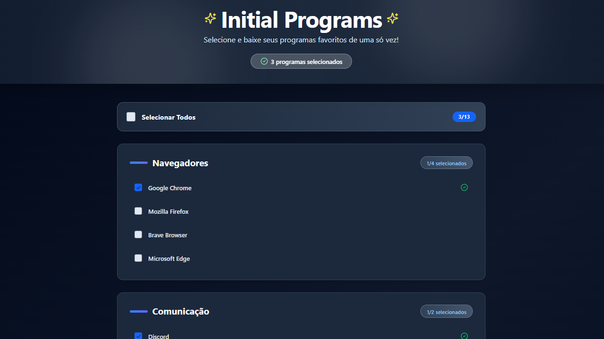

# 🖥️ Initial Programs

Projeto desenvolvido afim de facilitar o download de programas e ferramentas comuns utilizadas no dia dia de uma só vez.

## 📸 Preview

<table align="center">
  <tr>
    <td valign="center">
      
    </td>
  </tr>
</table>

🔗 **Demo:** https://projeto-initial-programs-dpln.vercel.app/

⚠️  Nota: Os programas serão abertos em novas abas. Certifique-se de permitir pop-ups no seu navegador para que todos os downloads sejam iniciados corretamente.

<br>

<div align="center">


</div>

---

## ✨ Features

- 📋 Listagem dinâmica    
- ➕ Adição e remoção de itens     
- 🎨 Interface responsiva  

---

## 📦 Como rodar o projeto

```bash
git clone https://github.com/mcdcwb/projeto-initial-programs.git
cd projeto-initial-programs
npm install
npm run dev
```

---

## 🚀 Stacks utilizadas:
<div style="display: inline_block">
    
    
    
</div>
